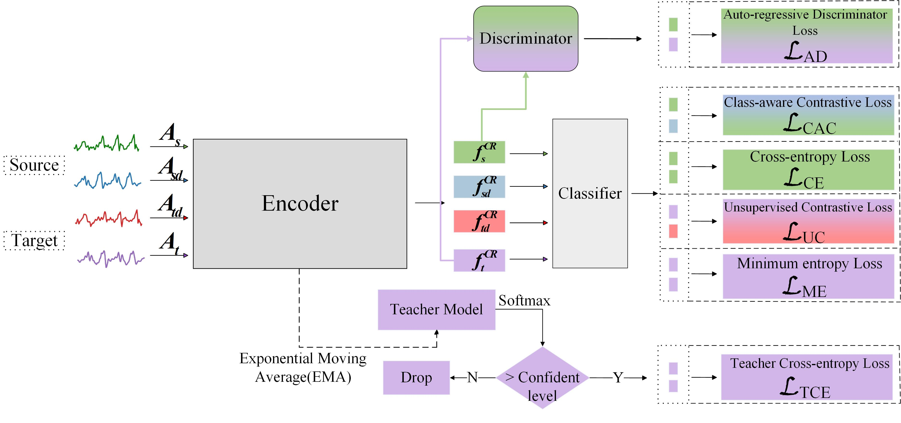
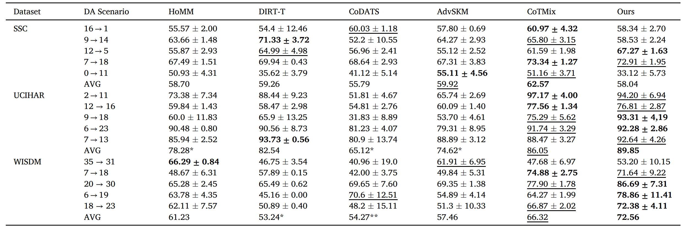

# SDCADA:  Self-supervised deep contrastive and auto-regressive domain adaptation for time-series based on channel recalibration [[Paper](https://doi.org/10.1016/j.engappai.2025.110280)] [[Cite](#citation)]

### This work has been accepted for publication in the Engineering Applications of Artificial Intelligence(EAAI).

### The code and the experimental datasets are adopted from [AdaTime framework](https://github.com/emadeldeen24/AdaTime)

## Abstract
<p align="center">

</p>


Time-series based unsupervised domain adaptation (UDA) techniques have been widely adopted to the applications of artificial intelligence, such as sleep staging, fault diagnosis, and human activity recognition. However, recently methods have overlooked the importance of temporal feature representation and the distribution discrepancy across domains, which can deteriorate adaptation performance. To address these challenges, we proposed a novel Self-supervised Deep Contrastive and Auto-regressive Domain Adaptation (SDCADA) method for cross-domain time-series classification. Specifically, the cross-domain mixup preprocessing strategy is applied for both source and target domains, then we proposed to introduce the channel recalibration module after stacked convolutional blocks. Afterwards, the auto-regressive discriminator and teacher model are proposed to reduce the distribution discrepancy of feature representations. Finally, a total of six losses, including contrastive and adversarial learning, are weighted for the training of UDA models. The proposed SDCADA model has been systematically experimented on three time-series benchmarked datasets, and its classification performance surpasses several state-of-the-art models. Moreover, it effectively captures discriminative and comprehensive cross-domain time-series feature representations with parameter insensitivity.

## Results
<p align="center">

</p>


## Citation
If you found this work useful for you, please consider citing it.
```
@ARTICLE{xiaoYang-garbledCode2025SDCADA,
  author={Guangju Yang,Tian-jian Luo,Xiaochen Zhang},
  journal={Engineering Applications of Artificial Intelligence}, 
  title={Self-supervised deep contrastive and auto-regressive domain adaptation for time-series based on channel recalibration}, 
  year={2025},
  volume={},
  number={},
  pages={1-19},
  doi={10.1016/j.engappai.2022.105375}
}
@article{adatime,
  author = {Ragab, Mohamed and Eldele, Emadeldeen and Tan, Wee Ling and Foo, Chuan-Sheng and Chen, Zhenghua and Wu, Min and Kwoh, Chee-Keong and Li, Xiaoli},
  title = {ADATIME: A Benchmarking Suite for Domain Adaptation on Time Series Data},
  year = {2023},
  publisher = {Association for Computing Machinery},
  address = {New York, NY, USA},
  issn = {1556-4681},
  url = {https://doi.org/10.1145/3587937},
  doi = {10.1145/3587937},
  journal = {ACM Trans. Knowl. Discov. Data},
  month = {mar}
}
```

## Contact
For any issues/questions regarding the paper or reproducing the results, please contact me.   
Guangju Yang   
School of Computer Science and Cyberspace Security,
Fujian Normal University Fuzhou China.   
Email: 1747749798@qq.com 
